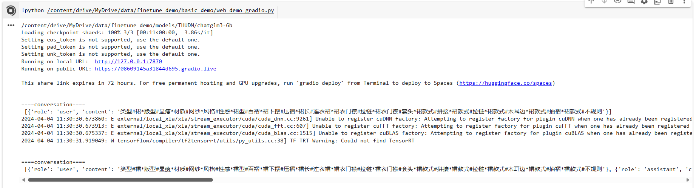
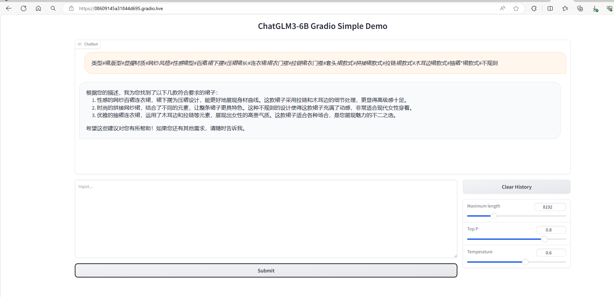
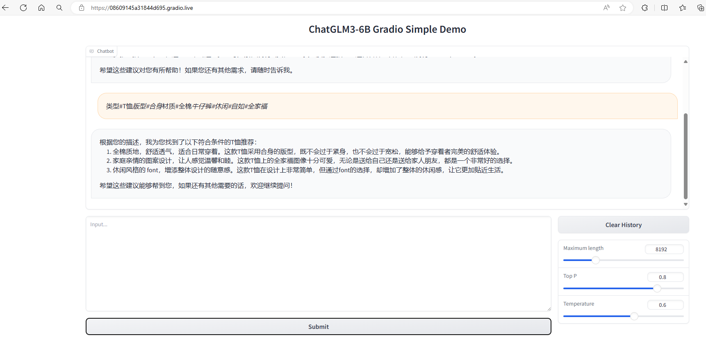
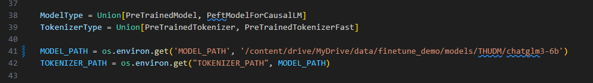

## 使用官方提供的示例，成功微调出广告数据集，要求使用 Lora 进行微调：

```
                                 Saving model checkpoint to ./output/tmp-checkpoint-7000
/usr/local/lib/python3.10/dist-packages/peft/utils/save_and_load.py:154: UserWarning: Could not find a config file in models/THUDM/chatglm3-6b - will assume that the vocabulary was not modified.
  warnings.warn(
{'loss': 3.0072, 'grad_norm': 7.547343730926514, 'learning_rate': 6.1125e-06, 'epoch': 0.98}
{'loss': 3.063, 'grad_norm': 7.4792280197143555, 'learning_rate': 5.95625e-06, 'epoch': 0.98}
{'loss': 3.0574, 'grad_norm': 7.037683010101318, 'learning_rate': 5.8e-06, 'epoch': 0.99}
{'loss': 3.0175, 'grad_norm': 7.853835105895996, 'learning_rate': 5.643750000000001e-06, 'epoch': 0.99}
{'loss': 3.0698, 'grad_norm': 7.513693332672119, 'learning_rate': 5.4875e-06, 'epoch': 0.99}
{'loss': 3.0502, 'grad_norm': 7.491745471954346, 'learning_rate': 5.33125e-06, 'epoch': 1.0}
 90% 7162/8000 [1:37:41<10:55,  1.28it/s]/usr/local/lib/python3.10/dist-packages/torch/utils/data/dataloader.py:558: UserWarning: This DataLoader will create 16 worker processes in total. Our suggested max number of worker in current system is 12, which is smaller than what this DataLoader is going to create. Please be aware that excessive worker creation might get DataLoader running slow or even freeze, lower the worker number to avoid potential slowness/freeze if necessary.
  warnings.warn(_create_warning_msg(
{'loss': 3.0221, 'grad_norm': 6.929961204528809, 'learning_rate': 5.175e-06, 'epoch': 1.0}
{'loss': 3.04, 'grad_norm': 7.7233099937438965, 'learning_rate': 5.018750000000001e-06, 'epoch': 1.01}
{'loss': 3.0187, 'grad_norm': 7.554509162902832, 'learning_rate': 4.8625000000000005e-06, 'epoch': 1.01}
{'loss': 2.9872, 'grad_norm': 7.271574974060059, 'learning_rate': 4.70625e-06, 'epoch': 1.01}
{'loss': 3.0258, 'grad_norm': 7.418499946594238, 'learning_rate': 4.5500000000000005e-06, 'epoch': 1.02}
{'loss': 3.005, 'grad_norm': 7.169942855834961, 'learning_rate': 4.39375e-06, 'epoch': 1.02}
{'loss': 2.9888, 'grad_norm': 7.718091011047363, 'learning_rate': 4.2375000000000005e-06, 'epoch': 1.02}
{'loss': 3.0124, 'grad_norm': 7.047276496887207, 'learning_rate': 4.08125e-06, 'epoch': 1.03}
{'loss': 3.0173, 'grad_norm': 7.40697717666626, 'learning_rate': 3.9250000000000005e-06, 'epoch': 1.03}
{'loss': 3.0602, 'grad_norm': 7.033374309539795, 'learning_rate': 3.76875e-06, 'epoch': 1.03}
{'loss': 2.9728, 'grad_norm': 7.6466169357299805, 'learning_rate': 3.6124999999999997e-06, 'epoch': 1.04}
{'loss': 3.0422, 'grad_norm': 7.1010284423828125, 'learning_rate': 3.4562500000000006e-06, 'epoch': 1.04}
{'loss': 3.0333, 'grad_norm': 7.296413421630859, 'learning_rate': 3.3e-06, 'epoch': 1.04}
{'loss': 3.0028, 'grad_norm': 7.62086820602417, 'learning_rate': 3.14375e-06, 'epoch': 1.05}
{'loss': 3.0204, 'grad_norm': 7.557666301727295, 'learning_rate': 2.9875e-06, 'epoch': 1.05}
{'loss': 3.0165, 'grad_norm': 7.265463352203369, 'learning_rate': 2.83125e-06, 'epoch': 1.05}
{'loss': 3.0515, 'grad_norm': 7.109556674957275, 'learning_rate': 2.6750000000000002e-06, 'epoch': 1.06}
{'loss': 3.0356, 'grad_norm': 7.275899887084961, 'learning_rate': 2.5187500000000002e-06, 'epoch': 1.06}
{'loss': 3.0365, 'grad_norm': 6.979001998901367, 'learning_rate': 2.3625000000000003e-06, 'epoch': 1.06}
{'loss': 3.0347, 'grad_norm': 7.159457683563232, 'learning_rate': 2.20625e-06, 'epoch': 1.07}
{'loss': 3.0036, 'grad_norm': 7.5897698402404785, 'learning_rate': 2.0500000000000003e-06, 'epoch': 1.07}
{'loss': 3.0234, 'grad_norm': 7.658105373382568, 'learning_rate': 1.89375e-06, 'epoch': 1.08}
{'loss': 3.0125, 'grad_norm': 7.263454914093018, 'learning_rate': 1.7375000000000003e-06, 'epoch': 1.08}
{'loss': 3.018, 'grad_norm': 7.208878993988037, 'learning_rate': 1.5812500000000001e-06, 'epoch': 1.08}
{'loss': 3.0065, 'grad_norm': 7.741599082946777, 'learning_rate': 1.4250000000000001e-06, 'epoch': 1.09}
{'loss': 3.0097, 'grad_norm': 7.645491600036621, 'learning_rate': 1.2687500000000001e-06, 'epoch': 1.09}
{'loss': 3.026, 'grad_norm': 7.225083351135254, 'learning_rate': 1.1125e-06, 'epoch': 1.09}
{'loss': 3.0569, 'grad_norm': 6.495636463165283, 'learning_rate': 9.5625e-07, 'epoch': 1.1}
{'loss': 3.0412, 'grad_norm': 7.361515045166016, 'learning_rate': 8.000000000000001e-07, 'epoch': 1.1}
{'loss': 3.0092, 'grad_norm': 7.14296817779541, 'learning_rate': 6.4375e-07, 'epoch': 1.1}
{'loss': 2.9842, 'grad_norm': 7.491602897644043, 'learning_rate': 4.875e-07, 'epoch': 1.11}
{'loss': 3.0607, 'grad_norm': 7.561606407165527, 'learning_rate': 3.3125e-07, 'epoch': 1.11}
{'loss': 3.0337, 'grad_norm': 7.02121639251709, 'learning_rate': 1.7500000000000002e-07, 'epoch': 1.11}
{'loss': 3.0103, 'grad_norm': 7.3705244064331055, 'learning_rate': 1.8750000000000002e-08, 'epoch': 1.12}
100% 8000/8000 [1:48:49<00:00,  1.25it/s]***** Running Evaluation *****
  Num examples = 50
  Batch size = 16

  0% 0/4 [00:00<?, ?it/s]
 50% 2/4 [00:10<00:10,  5.32s/it]
 75% 3/4 [00:13<00:04,  4.47s/it]
                                         
{'eval_rouge-1': 33.025688, 'eval_rouge-2': 7.92154, 'eval_rouge-l': 26.046530000000004, 'eval_bleu-4': 0.03948887202244507, 'eval_runtime': 20.6878, 'eval_samples_per_second': 2.417, 'eval_steps_per_second': 0.193, 'epoch': 1.12}
100% 8000/8000 [1:49:09<00:00,  1.25it/s]
100% 4/4 [00:16<00:00,  3.65s/it]
                                 Saving model checkpoint to ./output/tmp-checkpoint-8000
/usr/local/lib/python3.10/dist-packages/peft/utils/save_and_load.py:154: UserWarning: Could not find a config file in models/THUDM/chatglm3-6b - will assume that the vocabulary was not modified.
  warnings.warn(


Training completed. Do not forget to share your model on huggingface.co/models =)


{'train_runtime': 6550.1313, 'train_samples_per_second': 19.542, 'train_steps_per_second': 1.221, 'train_loss': 3.123331298828125, 'epoch': 1.12}
100% 8000/8000 [1:49:10<00:00,  1.22it/s]
/usr/local/lib/python3.10/dist-packages/torch/utils/data/dataloader.py:558: UserWarning: This DataLoader will create 16 worker processes in total. Our suggested max number of worker in current system is 12, which is smaller than what this DataLoader is going to create. Please be aware that excessive worker creation might get DataLoader running slow or even freeze, lower the worker number to avoid potential slowness/freeze if necessary.
  warnings.warn(_create_warning_msg(
***** Running Prediction *****
  Num examples = 1070
  Batch size = 16
100% 67/67 [06:06<00:00,  5.48s/it]
```

[lora_finetune notebook](lora_finetune_4_4.ipynb) and [log](homework_finetune_log.txt)


##  你需要自己适配 inference.py 中的代码，并迁移到其他的推理框架中。例如，basic_demo 中没有读取微调模型后的 adapter 的内容，你需要参考 inference.py 的代码并进行修改，让其他 demo 能读入你的微调代码，将其部署到 basic_demo 下的 gradio_demo 中，并能够通过 webui 来进行调用。







[lora finetune inference notebook](lora_finetune_inference.ipynb) 


